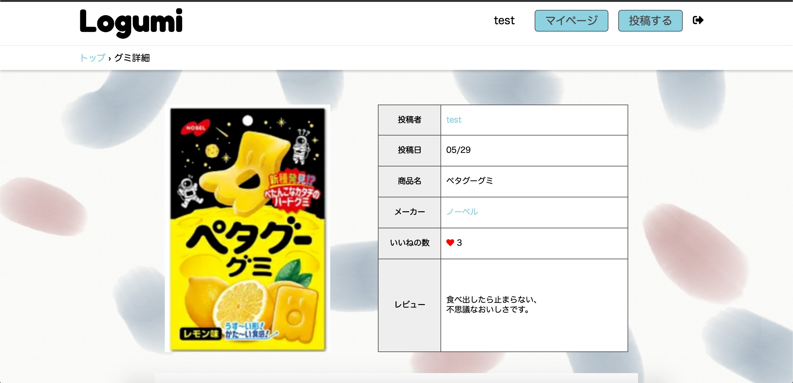

# Logumi

## 概要
食べたグミ、オススメしたいグミを登録して公開することができます。他の人が登録したグミを見て、いいね・コメントができます。

## バージョン
- macOS Catalina 10.15.5
- Rails 5.2.4.3
- Ruby 2.5.1
- Heroku

## デプロイ情報
- Heroku URL  
https://logumi.herokuapp.com/  

- 認証
  - ユーザ：admin
  - パスワード：0909

- テストアカウント
  - メールアドレス：test@sample  
  - パスワード：000000

## 主な機能
### ユーザ
- ユーザー登録、ログイン、ログアウト
- ユーザマイページから細かな情報を編集可能
- ユーザマイページで投稿したグミの一覧表示

### グミ
- 新規投稿、編集
- 一覧画面から検索可能
- 詳細画面のメーカー名はメーカーHPにリンク
- 詳細画面から非同期通信にてコメント可能

### その他
- パンくず機能で現在地をページ上部に表示
- いいね機能、いいねされた数の表示

 

## 今後実装したいこと
- SNSのAPIを用いたユーザーの新規登録とログイン(gem 'OmniAuth')
- 人気グミのランキング表示
- レスポンシブデザイン

## DB設計
### usersテーブル
|Column|Type|Options|
|------|----|-------|
|name|string|null: false, index: true|
|email|string|null: false|
|password|string|null: false|
|image|string|
|like|string|
|introducrion|text|
#### Association
- has_many :gummys
- has_many :commments

### gummiesテーブル
|Column|Type|Options|
|------|----|-------|
|product|text|null: false|
|content|text|
|image|string|
|maker_id|integer|null: false|
|user|references|null: false, foreign_key: true|
#### Association
- belongs_to :user

### favoritsテーブル
|Column|Type|Options|
|------|----|-------|
|user_id|integer|null: false, foreign_key: true|
|gummy_id|integer|null: false, foreign_key: true|
#### Association
- belongs_to :user
- belongs_to :gummy

### commentsテーブル
|Column|Type|Options|
|------|----|-------|
|text|text|
|user|references|null: false, foreign_key: true|
|gummy|references|null: false, foreign_key: true|
#### Association
- belongs_to :user
- belongs_to :gummy